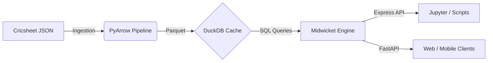

<div align="center">
  

  # Midwicket
  
  **The Open Source Cricket Intelligence SDK**

  <p align="center">
    <a href="https://pypi.org/project/midwicket/"></a>
    <a href="https://github.com/CodersAcademy006/Midwicket/actions"></a>
    <a href="https://pypi.org/project/midwicket/"></a>
    <a href="https://github.com/CodersAcademy006/Midwicket/blob/main/LICENSE"></a>
  </p>

  <p align="center">
    <i>Lightning-fast, deterministic, and scalable cricket analytics built on modern data engineering.</i>
  </p>
</div>

---

## About Midwicket

Midwicket is an advanced, high-performance cricket intelligence SDK and analytics engine designed for data scientists, application developers, and sports analysts. It moves beyond standard API wrappers by introducing a scalable, agent-based architecture capable of executing sub-millisecond analytical queries. Leveraging vectorized PyArrow operations and DuckDB engines, Midwicket provides a highly optimized environment for analyzing comprehensive ball-by-ball datasets.

### Key Features

*   **High Performance:** Powered by vectorized PyArrow operations and DuckDB for sub-millisecond analytical queries.
*   **Agent-Based Architecture:** Specialized internal agents (Gatekeeper, Planner, Archivist) systematically isolate logic, ensuring scalable and maintainable operations.
*   **Predictive Machine Learning:** Integrates built-in statistical models, including real-time Win Probability calculations.
*   **Type-Safe and Deterministic:** Employs immutable V1 schemas enforced via Pydantic. Queries are securely hashed and natively cached.
*   **Production-Ready Deployment:** Ships natively with a FastAPI backend, comprehensive Docker configuration, Prometheus metrics, and Grafana dashboards for enterprise-grade observability.

---

## Architecture

The Midwicket engine employs a strict separation of concerns, processing raw telemetry and play-by-play data into highly structured formats suitable for OLAP workloads. Raw JSON data is processed, flattened into Parquet format utilizing PyArrow, and subsequently served analytically by an embedded DuckDB instance.



---

## Installation

Midwicket is published on the Python Package Index (PyPI). It is recommended to install the package within an isolated virtual environment.

### 1. Install the Package

```bash
pip install midwicket
```

### 2. Data Initialization

Midwicket utilizes the comprehensive ball-by-ball dataset provided by Cricsheet. A one-time initialization process is required to populate the local DuckDB instance.

```python
from midwicket.data.loader import DataLoader

loader = DataLoader()
loader.download()
```

---

## API Examples

Midwicket provides an accessible Express API interface for rapid analytical operations alongside lower-level interfaces for complex requirements.

### Player Analytics

```python
import midwicket.express as px

# Retrieve comprehensive lifetime statistics for a specific player
stats = px.get_player_stats("Virat Kohli")
print(f"Player: {stats.name} | Runs: {stats.runs} | Matches: {stats.matches}")
```

### Predictive Modeling (Win Probability)

```python
import midwicket.express as px

# Calculate live win probability based on current match conditions
result = px.predict_win(
    venue="Wankhede Stadium", 
    target=180, 
    current_runs=120, 
    wickets_down=5, 
    overs_completed=15.0
)
print(f"Win Probability: {result['win_prob']:.4f}")
```

### Direct SQL Engine Access

For scenarios demanding complex analytical formulations, Midwicket permits direct access to the underlying DuckDB engine.

```python
from midwicket.storage.engine import QueryEngine

engine = QueryEngine("./data/midwicket.duckdb")
results = engine.execute_sql("""
    SELECT batter_id, SUM(runs_batter) AS total_runs
    FROM ball_events
    GROUP BY batter_id
    ORDER BY total_runs DESC 
    LIMIT 5
""")
print(results.to_pandas())
```

---

## Data Models

Midwicket utilizes Pydantic to enforce rigorous data validation and structural integrity across its APIs.

*   `PlayerStats`: Encapsulates aggregate player performance metrics (e.g., `runs`, `matches`, `strike_rate`).
*   `MatchContext`: Represents the contextual parameters of a match required for predictive models (e.g., `venue`, `target`, `current_runs`).
*   `BallEvent`: The fundamental unit of data representing a single delivery, structured for columnar aggregation.

---

## Deployment

Midwicket is engineered for scalable production deployments. A comprehensive Dockerized environment is provided.

```bash
# Clone the repository
git clone https://github.com/CodersAcademy006/Midwicket.git
cd Midwicket

# Configure environment variables
cp .env.example .env

# Deploy the FastAPI backend, along with Grafana and Prometheus observability stacks
docker-compose up -d
```

To configure Rate Limiting, API Keys, and CORS for production environments, consult the parameters defined within the `.env.example` file. Alternatively, a standalone REST API server can be initialized directly:

```bash
python -c "from midwicket import serve; serve()"
```

---

## Contributing

Contributions to Midwicket are highly encouraged. Areas of active development include the integration of novel data sources, query optimization within the DuckDB layer, and the expansion of internal machine learning models.

Before submitting code, please review the Architecture Guide to familiarize yourself with the internal agent patterns.

1. Fork the repository.
2. Create a feature branch (`git checkout -b feature/enhancement-name`).
3. Ensure all tests pass (`pytest`).
4. Submit a detailed Pull Request.

---

## License

Midwicket is open-source software released under the MIT License.
