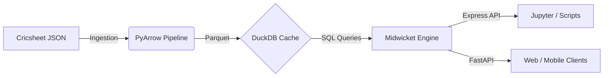

<div align="center">
  

  # 🏏 Midwicket
  
  **The Open Source Cricket Intelligence SDK**

  <p align="center">
    <a href="https://pypi.org/project/midwicket/"></a>
    <a href="https://github.com/CodersAcademy006/Midwicket/actions"></a>
    <a href="https://pypi.org/project/midwicket/"></a>
    <a href="https://github.com/CodersAcademy006/Midwicket/blob/main/LICENSE"></a>
  </p>

  <p align="center">
    <i>Lightning-fast, deterministic, and scalable cricket analytics built on modern data engineering.</i>
  </p>

  [**Installation**](#-quick-start) •
  [**API Reference**](midwicket/docs/api.md) •
  [**Architecture**](Agents.md) •
  [**Examples**](examples/) •
  [**Discuss**](https://github.com/CodersAcademy006/Midwicket/discussions)
</div>

---

## ✨ Why Midwicket?

Midwicket isn't just another API wrapper—it's a **powerful, agent-based analytics engine** designed from the ground up for data scientists, app developers, and absolute cricket nerds. 

🚀 **Lightning Fast:** Sub-millisecond analytical queries powered by vectorized PyArrow operations and DuckDB engines.  
🧠 **Agent-Based Architecture:** Specialized internal agents (Gatekeeper, Planner, Archivist) isolate logic for scalable operations.  
🔮 **Predictive ML:** Built-in Win Probability models out of the box.  
🛡️ **Type-Safe & Deterministic:** Immutable V1 schemas enforced by Pydantic. Queries are securely hashed and natively cached.  
🔌 **Ready for Production:** Ships with a FastAPI backend, Docker setups, Prometheus metrics, and Grafana tracking.

---

## ⚡ Quick Start

### 1. Install the Package

```bash
pip install midwicket
```

### 2. Download the Dataset
Midwicket leverages [Cricsheet](https://cricsheet.org)'s incredible ball-by-ball dataset. You only need to run this once to populate your local DuckDB instance (~50MB).

```python
from midwicket.data.loader import DataLoader

loader = DataLoader()
loader.download()
```

### 3. Start Analyzing!
We provide a beautiful **Express API** for one-liner analysis:

```python
import midwicket.express as px

# 🏏 Get Lifetime Stats
stats = px.get_player_stats("Virat Kohli")
print(f"{stats.name} has absolutely smashed {stats.runs} runs in {stats.matches} matches.")

# 🔮 Predict Win Probability Live
result = px.predict_win(
    venue="Wankhede Stadium", 
    target=180, 
    current_runs=120, 
    wickets_down=5, 
    overs_completed=15.0
)
print(f"Win Probability: {result['win_prob']:.1%}")
```

> [!TIP]
> **Building a web app?** You can launch the built-in REST API instantly:
> ```bash
> python -c "from midwicket import serve; serve()"
> ```

---

## 🏗️ Architecture

Midwicket's engine is built on a clean separation of concerns. Raw JSON is heavily processed, flattened into Parquet using PyArrow, and served analytically by an embedded DuckDB instance.



---

## 📊 Key Capabilities

<details>
<summary><b>1. Fantasy Cricket Cheat Sheets</b></summary>

Generate venue-specific fantasy picks based on historical point averages.
```python
from midwicket.api.fantasy import cheat_sheet
top_picks = cheat_sheet("Eden Gardens")
print(top_picks.head(10))
```
</details>

<details>
<summary><b>2. Direct SQL Engine Access</b></summary>

Bypass the SDK methods and run blazing fast queries directly against the historical event table.
```python
from midwicket.storage.engine import QueryEngine

engine = QueryEngine("./data/midwicket.duckdb")
results = engine.execute_sql("""
    SELECT batter_id, SUM(runs_batter) AS total_runs
    FROM ball_events
    GROUP BY batter_id
    ORDER BY total_runs DESC LIMIT 5
""")
print(results.to_pandas())
```
</details>

<details>
<summary><b>3. Live Match Overlays</b></summary>

Calculate match situations mathematically using the SDK, then generate live broadcasting overlays or PDF reports for post-match analysis natively.
</details>

---

## 🐳 Deployment

Midwicket is built to handle traffic. We provide native dockerization.

```bash
git clone https://github.com/CodersAcademy006/Midwicket.git
cd Midwicket
cp .env.example .env

# Deploy the FastAPI Backend, Grafana, and Prometheus
docker-compose up -d
```
> [!IMPORTANT]
> To configure Rate Limiting, API Keys, and CORS in production, make sure to read the `.env.example` file carefully.

---

## 🤝 Contributing

We love contributions! Whether you're adding support for new data sources, optimizing the DuckDB queries, or expanding the ML models to include pitch bias—your PRs are welcome. 

Please read the [Architecture Guide](Agents.md) before starting to understand the agent patterns used throughout the codebase.

1. Fork the repo
2. Create a feature branch (`git checkout -b feature/magic-ball`)
3. Run the tests (`pytest`)
4. Submit a Pull Request

---

## 📜 License

Midwicket is completely open-source and released under the **MIT License**. Use it, break it, fix it, and build cool things with it.

<br>
<br>

<div align="center">
  <h3>Made with ❤️ by Srijan Upadhyay</h3>
  <i>Built to flex.</i>
</div>
