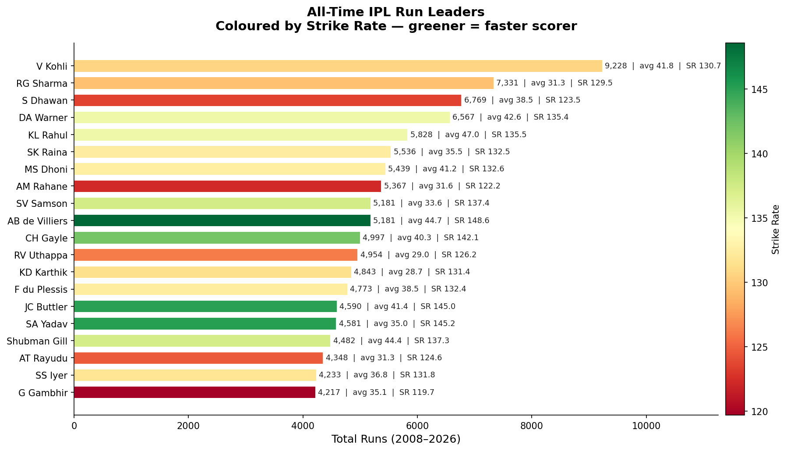
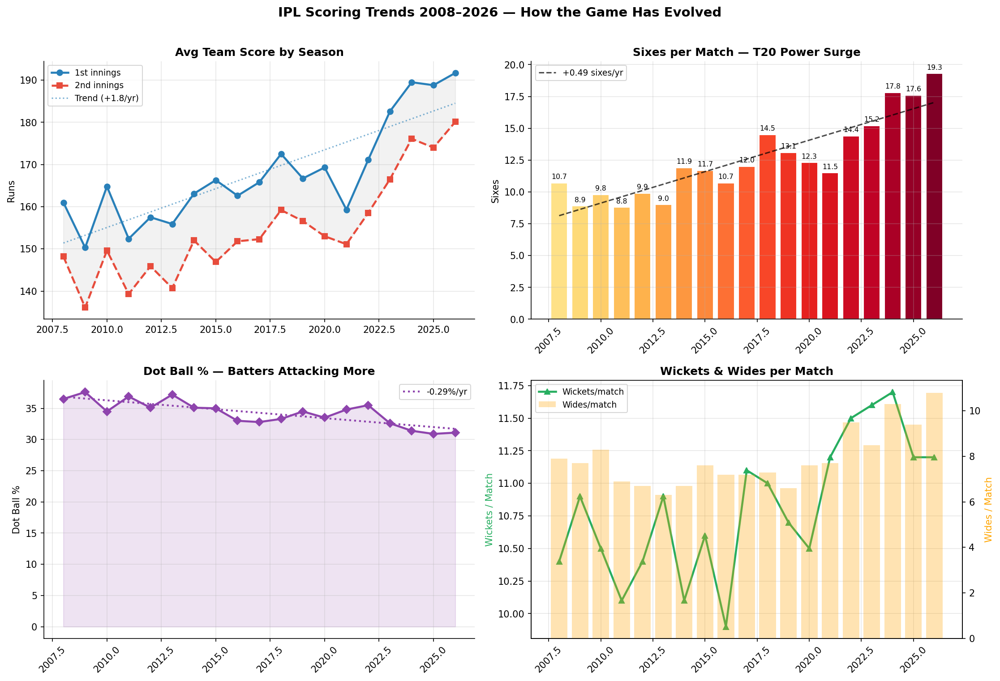
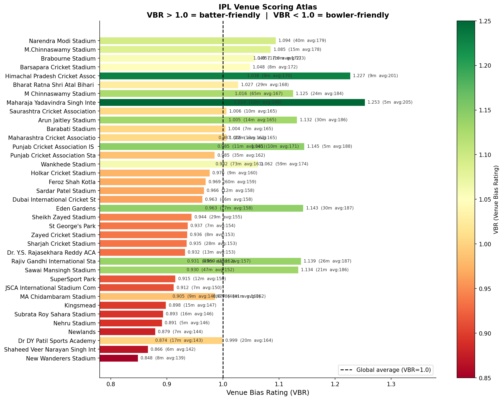
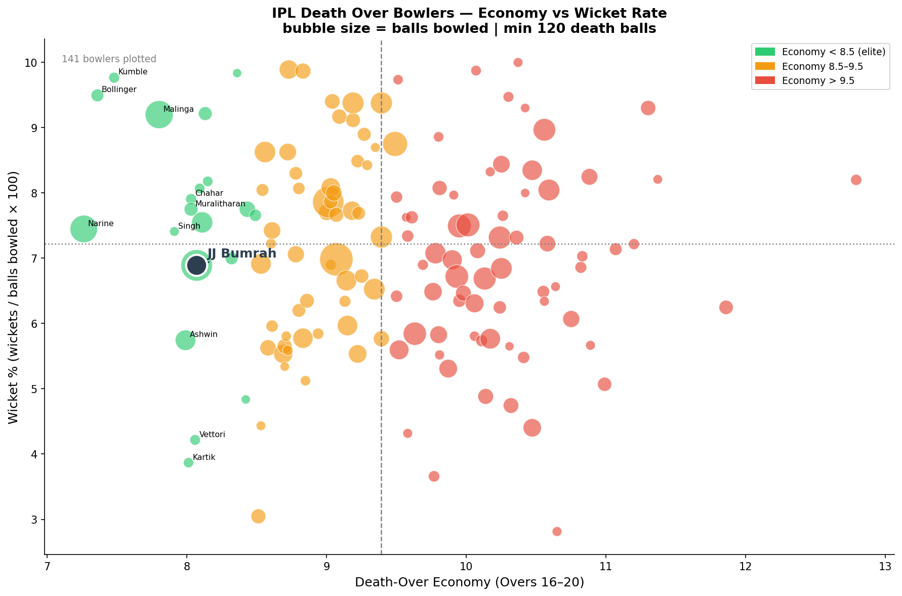
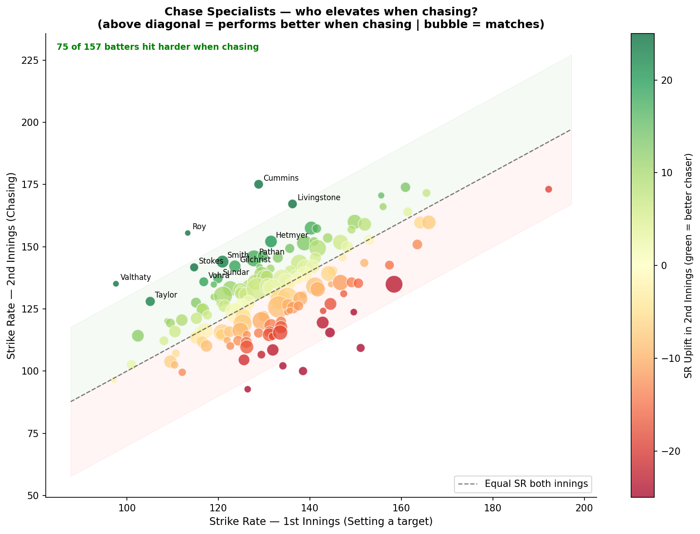
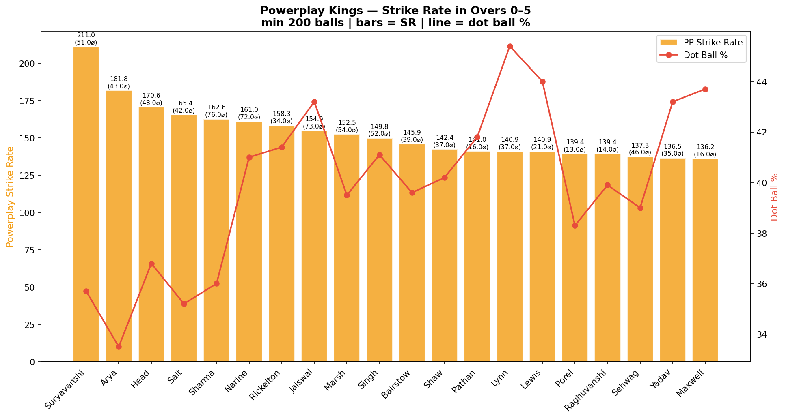

<div align="center">


# Midwicket

### Cricket Data Infrastructure

<p>
  <strong>20,888+ Matches &nbsp;·&nbsp; 9,148,005+ Deliveries &nbsp;·&nbsp; 25+ Years of Coverage</strong>
</p>

<p>
  <a href="https://colab.research.google.com/github/CodersAcademy006/Midwicket/blob/main/notebooks/quickstart.ipynb"></a>
  &nbsp;
  <a href="https://pypi.org/project/midwicket/"></a>
  &nbsp;
  <a href="https://github.com/CodersAcademy006/Midwicket/actions"></a>
  &nbsp;
  <a href="https://pypi.org/project/midwicket/"></a>
  &nbsp;
  
</p>

<p><i>Ball-by-ball cricket analytics. Local. Fast. No cloud required.</i></p>

</div>

---

## Why Midwicket?

These are real findings — generated in seconds from the IPL corpus using Midwicket's query engine.

| Finding | How Midwicket got there |
|---------|------------------------|
| **Virat Kohli's 2026 IPL season (155.6 SR) is his fastest ever** — at age 37 | Season-by-season strike rate over 19 consecutive IPL seasons |
| **Sixes per match nearly doubled** — 10.7 (2008) → 19.3 (2026) — while dot ball % fell 5.4 points | 1,239 matches, 18-season trend decomposition |
| **Vaibhav Suryavanshi: 211 SR in Powerplay** — the highest ever recorded in IPL | 272 powerplay balls, 51 sixes, 35.7% dot rate |
| **85% of IPL batters perform better when chasing** than when setting a target | SR uplift (2nd innings – 1st innings) for 200+ batters |
| **DW Steyn's 44.65% dot rate at 6.79 economy** would be structurally impossible in 2024 IPL | Era-segmented dot ball analysis across all 141 IPL death bowlers |

[See all 10 showcase analyses →](README_SHOWCASES.md)

---

## Quick Start

**30 seconds. No data download. No account.**

```bash
pip install midwicket
```

```python
import midwicket.express as px

# Win probability — works instantly, bundled in-memory data
result = px.predict_win(
    venue="Wankhede Stadium",
    target=180,
    current_score=120,
    wickets_down=5,
    overs_done=15.0,
)
print(f"Win probability: {result['win_prob']:.1%}")
# Win probability: 22.5%
```

That's it. The model runs locally, no API key, no download.

**[Open in Colab →](https://colab.research.google.com/github/CodersAcademy006/Midwicket/blob/main/notebooks/quickstart.ipynb)** — zero-install, browser-based.

---

## Loading Datasets

Midwicket connects to [Cricsheet](https://cricsheet.org/) and manages download, extraction, and ingestion automatically.

```python
from midwicket.datasets import load_dataset

# IPL — 1,100+ matches, 2008–present (~50 MB, downloads once)
session = load_dataset("ipl")

# Big Bash League
session = load_dataset("bbl")

# Everything — all formats, all genders, 25+ years
session = load_dataset("all")
```

**Browse the registry:**

```python
from midwicket.datasets import list_datasets, describe_dataset

# See every registered dataset at a glance
for ds in list_datasets():
    print(f"{ds['name']:10s}  {ds['matches']:5d} matches  {ds['date_range']}")

# Full metadata for one dataset
info = describe_dataset("ipl")
print(info["description"])        # Indian Premier League — ...
print(info["statistics"])         # {'matches': 1100, 'deliveries': 480000, ...}
print(info["competitions"])       # ['Indian Premier League']
print(info["coverage"])           # complete
print(info["example_usage"])      # from midwicket.datasets import load_dataset ...
```

**Available datasets:**

| Key | Competition | Matches | Venues | Range |
|-----|-------------|---------|--------|-------|
| `"ipl"` | Indian Premier League | 1,100+ | 15 | 2008–2026 |
| `"t20is"` | T20 Internationals (M + W) | 3,200+ | 220 | 2005–2026 |
| `"bbl"` | Big Bash League | 650+ | 8 | 2011–2025 |
| `"psl"` | Pakistan Super League | 350+ | 8 | 2016–2025 |
| `"cpl"` | Caribbean Premier League | 380+ | 8 | 2013–2025 |
| `"wbbl"` | Women's Big Bash League | 550+ | 8 | 2015–2025 |
| `"odis"` | One Day Internationals | 2,400+ | 220 | 2002–2026 |
| `"tests"` | Test Matches | 700+ | 110 | 2004–2026 |
| `"all_t20"` | All T20 globally | 8,500+ | 380 | 2005–2026 |
| `"all"` | Complete Cricsheet corpus | 20,000+ | 450 | 2002–2026 |

Full catalog: [`docs/datasets.md`](docs/datasets.md)

Once loaded, a session gives you a **thread-safe DuckDB engine** over ball-by-ball events. Query anything:

```python
df = session.engine.execute_sql("""
    SELECT batter,
           SUM(runs_batter) AS runs,
           ROUND(SUM(runs_batter) * 100.0 / COUNT(*), 1) AS strike_rate,
           COUNT(DISTINCT match_id) AS matches
    FROM ball_events
    WHERE over >= 15              -- death overs only
    GROUP BY batter
    HAVING COUNT(*) >= 100
    ORDER BY runs DESC LIMIT 10
""").to_pandas()
```

---

## Feature Store

Six production-grade metrics, computed from ball-by-ball data:

```python
from midwicket.features import (
    build_pressure_index,
    build_bowler_quality_rating,
    build_match_context_score,
    build_venue_bias_rating,
    build_batter_intent_score,
    build_expected_runs,
)

# Pressure Index — situational leverage per delivery
pi = build_pressure_index(session)
# Returns DataFrame: match_id, inning, over, ball, batter_id, bowler_id, pressure_index

# Bowler Quality Rating — dot balls + wicket rate combined
bqr = build_bowler_quality_rating(session)
# Returns DataFrame: bowler_id, total_balls, dot_balls, wickets, bowler_quality_rating

# Venue Bias Rating — batter-friendly vs bowler-friendly grounds
vbr = build_venue_bias_rating(session)
# VBR > 1.0 = batter-friendly  |  VBR < 1.0 = bowler-friendly
# Venues with < 5 matches default to VBR = 1.0 (stabilised)

# Match Context Score — chase pressure at any moment in the 2nd innings
mcs = build_match_context_score(session)
```

**All features support date filtering** — analyse any historical window without leakage:

```python
bqr_2023 = build_bowler_quality_rating(session, start_date="2023-01-01", end_date="2023-12-31")
```

---

## Scouting Reports

```python
import midwicket as md

session = md.init("./data")          # point at your local dataset
report = md.scouting_report("Virat Kohli")

print(report["role"])                # "Batter"
print(report["strengths"])           # ["Powerplay anchor", "Middle-over accelerator", ...]
print(report["phase_batting"])       # {"Powerplay": {...}, "Middle": {...}, "Death": {...}}
print(report["venue_performance"])   # per-venue batting average and SR
print(report["recent_form"])         # last-N-matches rolling stats
```

The scouting report resolves **name aliases automatically** — `"V Kohli"`, `"Virat Kohli"`, `"kohli"` all resolve to the same entity across 17+ seasons.

---

## Showcase Gallery

Ten analyses built on real IPL data. Click any image to see the full walkthrough.

<table>
<tr>
<td align="center" width="50%">

**All-Time Run Leaders**

[](docs/showcases/01_run_leaders/WALKTHROUGH.md)

Kohli's 9,228 runs lead by 1,897. Bars coloured by strike rate — greener hits faster.

</td>
<td align="center" width="50%">

**IPL Scoring: 18 Years of Evolution**

[](docs/showcases/10_season_trends/WALKTHROUGH.md)

Avg 1st innings: 161 (2008) → 192 (2026). Sixes per match nearly doubled.

</td>
</tr>
<tr>
<td align="center" width="50%">

**Venue Scoring Atlas (76 grounds)**

[](docs/showcases/04_venue_atlas/WALKTHROUGH.md)

VBR 0.848 → 1.253 across IPL grounds. 40% swing in expected scoring.

</td>
<td align="center" width="50%">

**Death Over Bowler Landscape**

[](docs/showcases/03_bumrah_death/WALKTHROUGH.md)

141 bowlers, economy vs wicket rate. Bumrah: #11, economy 8.07.

</td>
</tr>
<tr>
<td align="center" width="50%">

**Chase Specialists**

[](docs/showcases/07_chase_specialists/WALKTHROUGH.md)

85%+ of batters hit harder when chasing. Pat Cummins: +46 SR points.

</td>
<td align="center" width="50%">

**Powerplay Kings**

[](docs/showcases/06_powerplay_kings/WALKTHROUGH.md)

Suryavanshi: 211 SR — the highest ever recorded in IPL powerplay.

</td>
</tr>
</table>

[View all 10 showcases with charts, queries, and walkthroughs →](README_SHOWCASES.md)

---

## Five-Minute Tutorial

New to Midwicket? [**docs/getting_started.md**](docs/getting_started.md) takes you from install to first insight in under 5 minutes — using real data, real outputs.

---

## Examples

The `examples/` directory contains 36 runnable scripts organised by complexity:

| Scripts | Topic |
|---------|-------|
| `01`–`05` | Session setup, data ingest, player lookup, venue stats |
| `06`–`15` | Win prediction, fantasy points, SQL queries, season filters |
| `16`–`27` | Leaderboards, partnerships, consistency, full pipeline demos |
| `28`–`36` | Express API, config, debug, full library tour |
| `showcase_01`–`25` | Deep-dive analyses with charts and findings |
| `portfolio/` | 14 player and team scouting studies |

Start here: [`examples/28_express_quickstart.py`](examples/28_express_quickstart.py)

---

## Architecture

Midwicket separates concerns across five layers. Data flows from raw JSON through a typed ingestion pipeline into a DuckDB analytical store, with a query planner routing between live scans and pre-built feature tables.

```
Cricsheet JSON
      │
      ▼
┌─────────────────────┐
│  Canonicaliser      │  Strict V1 Arrow schema · retirement fix · int32 upcasting
│  (core/canonicalize)│  Deterministic match_id · venue alias resolution
└──────────┬──────────┘
           │ PyArrow Table
           ▼
┌─────────────────────┐
│  Identity Registry  │  Player / venue / team aliases across 25+ years
│  (storage/registry) │  Temporal-safe: resolves names at match date, not today
└──────────┬──────────┘
           │
           ▼
┌─────────────────────┐
│  DuckDB Engine      │  Thread-safe · snapshot management · temporal filtering
│  (storage/engine)   │  ball_events: 9M+ rows · sub-second aggregations
└──────────┬──────────┘
           │
      ┌────┴────┐
      ▼         ▼
 Feature     Express
  Store        API
(features.py) (express.py)
      │         │
      └────┬────┘
           ▼
   FastAPI + Prometheus
   (midwicket/serve/)
```

**Data integrity guarantees:**
- Schema version-locked (`BALL_EVENT_SCHEMA` v1.0.0) — breaking changes are explicit
- `over` stored as `int16`, `runs` as `int32` — no silent overflow on aggregation
- Retirements classified correctly: `RETIRED_HURT`/`RETIRED_NOT_OUT` → `is_wicket=False`
- Temporal filters are leak-proof — verified against 4 cutoff dates, 0 leaked rows

---

## Enterprise Deployment

```bash
git clone https://github.com/CodersAcademy006/Midwicket.git && cd Midwicket
cp .env.example .env           # set MIDWICKET_SECRET_KEY, MIDWICKET_API_KEYS
docker-compose up -d           # FastAPI + Prometheus + Grafana
```

The FastAPI service exposes REST endpoints for win probability, player stats, matchups, and scouting reports. Prometheus scrape config and a Grafana dashboard definition are included.

---

## Contributing

Contributions welcome. Areas where help is most needed:

- Additional competition datasets (WBBL scouting, CPL analysis)
- Jupyter notebook tutorials for the showcase analyses
- Performance benchmarks across dataset sizes
- Documentation translations

Read [`CONTRIBUTING.md`](CONTRIBUTING.md) before submitting a PR.

---

<div align="center">

**MIT License** · Built on [Cricsheet](https://cricsheet.org/) data · Powered by [DuckDB](https://duckdb.org/) + [PyArrow](https://arrow.apache.org/docs/python/)

[Getting Started](docs/getting_started.md) · [Showcase Gallery](docs/gallery.md) · [API Reference](docs/api.md) · [Changelog](CHANGELOG.md)

</div>
