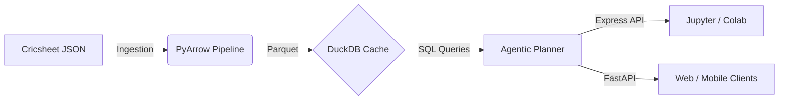

<div align="center">
  

  # Midwicket
  
  **The Open-Source Agentic Data SDK for Sports Intelligence**

  <p align="center">
    <a href="https://colab.research.google.com/github/CodersAcademy006/Midwicket/blob/main/notebooks/quickstart.ipynb"></a>
    <a href="https://pypi.org/project/midwicket/"></a>
    <a href="https://github.com/CodersAcademy006/Midwicket/actions"></a>
    <a href="https://pypi.org/project/midwicket/"></a>
  </p>

  <p align="center">
    <i>Lightning-fast, deterministic, and scalable cricket analytics powered by PyArrow, DuckDB, and AI Agents.</i>
  </p>
</div>

---

## The Problem
Processing unstructured sports telemetry is historically a nightmare. Traditional APIs are slow, schemas constantly break, and calculating complex metrics like "venue bias" or "live win probability" across millions of events requires expensive cloud data warehouses.

## The Midwicket Solution
Midwicket solves this by bringing the data warehouse to your laptop. It is an advanced, high-performance intelligence SDK that moves beyond standard API wrappers by introducing a scalable, **agent-based architecture** capable of executing sub-millisecond analytical queries locally. 

By leveraging vectorized **PyArrow** operations and an embedded **DuckDB** engine, Midwicket processes over 10 years of play-by-play data instantly.

### Key Innovations

*   **Sub-Millisecond Queries:** Powered by PyArrow and DuckDB for instant aggregations without cloud costs.
*   **Agent-Based Architecture:** Specialized internal agents (Gatekeeper, Planner, Archivist) systematically isolate logic, routing queries dynamically.
*   **Predictive Machine Learning:** Integrates built-in statistical models, including real-time Win Probability calculations.
*   **Type-Safe & Deterministic:** Employs immutable V1 schemas enforced via Pydantic. Queries are securely hashed and natively cached.
*   **Production-Ready:** Ships natively with a FastAPI backend, Docker configurations, Prometheus metrics, and Grafana dashboards.

---

## Architecture

The Midwicket engine employs a strict separation of concerns, utilizing an agentic planner to optimize execution paths between raw Parquet scans and materialized DuckDB views.



---

## Quick Start

**Try it instantly in your browser — no install required:**

[](https://colab.research.google.com/github/CodersAcademy006/Midwicket/blob/main/notebooks/quickstart.ipynb)

---

### Step 1 — Install

```bash
pip install midwicket
```

---

### Step 2 — Run a prediction (no data download needed)

The win probability model runs entirely in memory. No dataset, no waiting.

```python
import midwicket.express as px

result = px.predict_win(
    venue="Wankhede Stadium",
    target=180,
    current_score=120,
    wickets_down=5,
    overs_done=15.0,
)
print(f"Win Probability: {result['win_prob']:.1%}")
# Win Probability: 34.2%
```

---

### Step 3 — Load the full historical dataset (optional)

When you are ready to query player stats, head-to-head records, and venue analysis
across 10+ years of IPL data, run the one-time download (~50 MB from Cricsheet):

```python
from midwicket.data.loader import DataLoader
import midwicket.express as px

# Downloads once, cached locally at ~/.midwicket_data
DataLoader().download()

stats = px.get_player_stats("Virat Kohli")
print(f"Player: {stats.name} | Runs: {stats.runs} | Strike Rate: {stats.strike_rate}")

matchup = px.get_matchup("V Kohli", "JJ Bumrah")
print(f"Head-to-head | Matches: {matchup.matches} | Average: {matchup.average:.1f}")
```

---

## Enterprise Deployment

Midwicket is engineered for scalable production deployments. A comprehensive Dockerized environment is provided.

```bash
# Clone the repository
git clone https://github.com/CodersAcademy006/Midwicket.git
cd Midwicket

# Configure environment variables
cp .env.example .env

# Deploy the FastAPI backend + Grafana observability stack
docker-compose up -d
```

## Contributing
Contributions are highly encouraged! We are actively looking for help with:
- Expanding the built-in Machine Learning models.
- Optimizing DuckDB materialized views.
- Writing tests for the Agentic Planner.

Before submitting code, please review the internal agent patterns.

## License
Midwicket is open-source software released under the MIT License.
