# Showcase Gallery

Ten analyses built on 1,239 IPL matches (2008–2026), 294,757 deliveries.  
Every chart, query, and finding is reproducible — run `python3 docs/showcases/<n>/` or open the linked walkthrough.

---

## 01 — All-Time IPL Run Leaders

> **Finding:** Virat Kohli's 9,228 career runs lead by 1,897. Bars coloured by strike rate reveal the tension: Warner and KL Rahul score fewer runs but faster. AB de Villiers in 100 fewer matches has the highest SR (148.6) of any top-5 scorer.


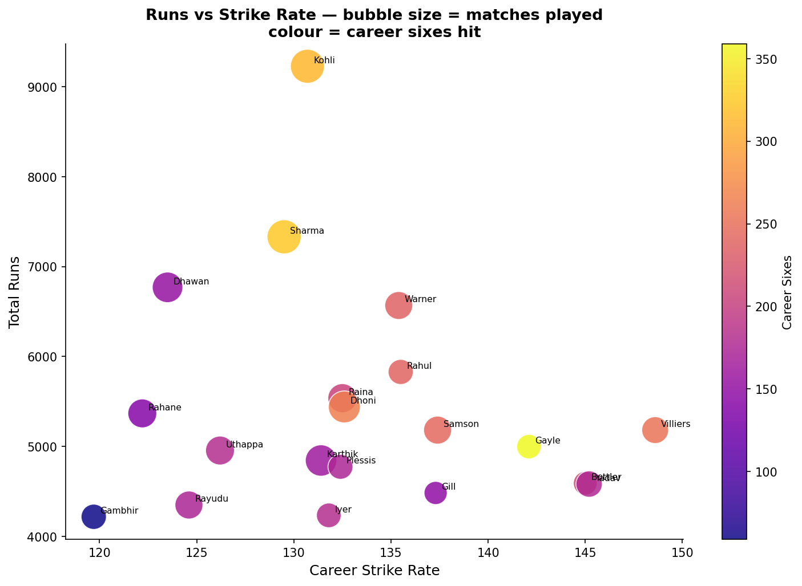

**The query (4 lines):**
```sql
SELECT batter,
       SUM(runs_batter) AS total_runs,
       ROUND(SUM(runs_batter) * 100.0 / COUNT(*), 1) AS strike_rate,
       COUNT(DISTINCT match_id) AS matches
FROM ball_events
GROUP BY batter HAVING COUNT(*) >= 300
ORDER BY total_runs DESC LIMIT 20;
```

**Top 5:**
```
       V Kohli  9,228 runs  SR 130.7  273 matches
     RG Sharma  7,331 runs  SR 129.5  275 matches
      S Dhawan  6,769 runs  SR 123.5  221 matches
     DA Warner  6,567 runs  SR 135.4  184 matches
      KL Rahul  5,828 runs  SR 135.5  149 matches
```

[Full walkthrough →](showcases/01_run_leaders/WALKTHROUGH.md)

---

## 02 — Virat Kohli: A 19-Season Scoring Profile

> **Finding:** 2026 is Kohli's fastest-ever IPL season (155.6 SR) at age 37. His over-by-over decomposition shows he plays conservatively in overs 3–5, peaks in middle overs, then re-accelerates at death. AB de Villiers is the only batter who out-struck him at Death.

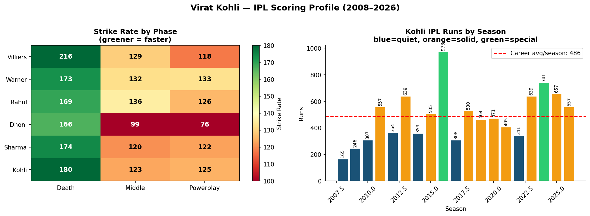

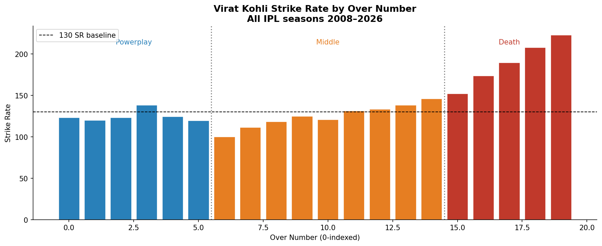

**The query:**
```sql
-- Phase SR heatmap
SELECT batter, phase,
       ROUND(SUM(runs_batter) * 100.0 / COUNT(*), 1) AS sr
FROM ball_events
WHERE batter IN ('V Kohli','AB de Villiers','DA Warner','KL Rahul','MS Dhoni','RG Sharma')
GROUP BY batter, phase HAVING COUNT(*) >= 30;

-- Season-by-season
SELECT EXTRACT(YEAR FROM date) AS season,
       SUM(runs_batter) AS runs,
       ROUND(SUM(runs_batter) * 100.0 / COUNT(*), 1) AS sr
FROM ball_events WHERE batter = 'V Kohli'
GROUP BY season ORDER BY season;
```

**Season highlights:**
```
2016: 973 runs  SR 148.5  — highest single-season IPL runs ever
2024: 741 runs  SR 149.1
2026: 557 runs  SR 155.6  — fastest-ever season at age 37
2008: 165 runs  SR  98.2  — the beginning
```

[Full walkthrough →](showcases/02_kohli_profile/WALKTHROUGH.md)

---

## 03 — Jasprit Bumrah: Death Over Dominance

> **Finding:** Among 141 IPL bowlers with 120+ balls in overs 16–20, Bumrah ranks #11 by economy (8.07). His economy has never exceeded 8.50 in any season. The scatter reveals the full competitive landscape he operates in.


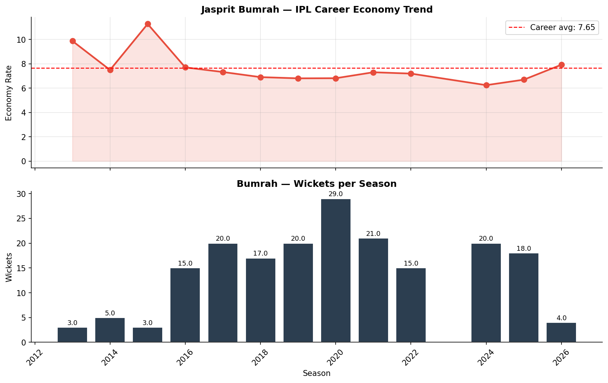

**The query:**
```sql
SELECT bowler,
       COUNT(*) AS death_balls,
       ROUND(SUM(runs_batter + runs_extras) * 6.0 / COUNT(*), 2) AS economy,
       SUM(CASE WHEN is_wicket AND wicket_type NOT IN ('RUN_OUT','RETIRED_OUT')
           THEN 1 ELSE 0 END) AS wickets
FROM ball_events
WHERE over >= 15
GROUP BY bowler HAVING COUNT(*) >= 120
ORDER BY economy ASC;
```

**Death over economy leaderboard (top 5, min 120 balls):**
```
   SP Narine   7.26 eco   84 wickets   36.6% dot
DE Bollinger   7.36 eco   23 wickets   36.4% dot
    A Kumble   7.48 eco   17 wickets   33.3% dot
  SL Malinga   7.80 eco  108 wickets   29.8% dot
 Harmeet Singh 7.91 eco   10 wickets   34.1% dot
...
  JJ Bumrah    8.07 eco  (rank #11)
```

[Full walkthrough →](showcases/03_bumrah_death/WALKTHROUGH.md)

---

## 04 — IPL Venue Scoring Atlas

> **Finding:** A 40% swing separates IPL's most batter-friendly ground (New Chandigarh, VBR 1.253) from its most bowler-friendly (New Wanderers, VBR 0.848). Knowing a venue's VBR before picking a team can shift expected score by 30+ runs.


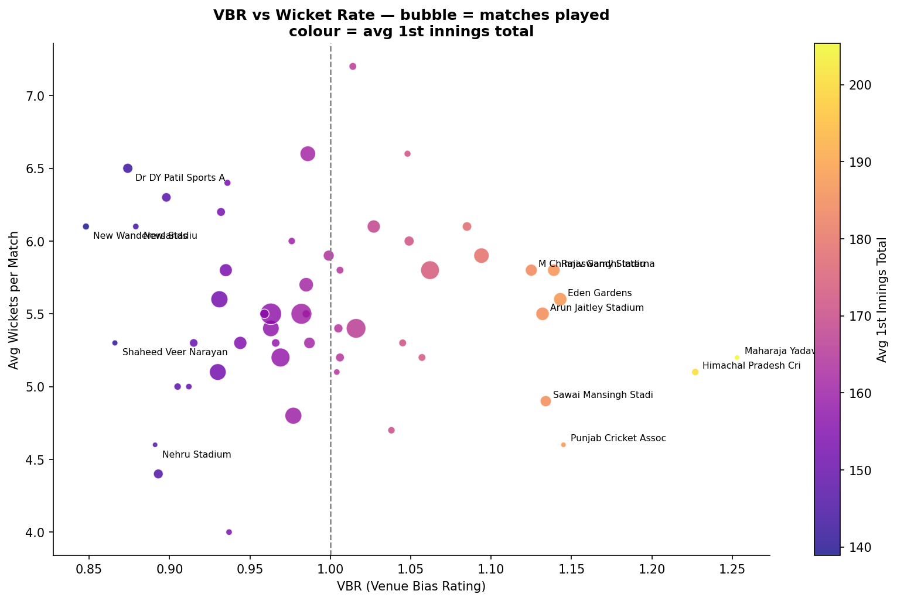

**The metric:**
```
VBR = Venue avg first-innings run rate
      ────────────────────────────────
      Global avg first-innings run rate

> 1.0 → batter-friendly   |   < 1.0 → bowler-friendly
Venues with < 5 matches → VBR = 1.0 (not enough evidence to claim bias)
```

**The query:**
```sql
SELECT venue,
       COUNT(DISTINCT match_id) AS matches,
       ROUND(AVG(runs_batter + runs_extras) * 120.0 /
             (SELECT AVG(runs_batter + runs_extras) * 120.0
              FROM ball_events WHERE inning = 1), 3) AS vbr
FROM ball_events WHERE inning = 1
GROUP BY venue HAVING COUNT(DISTINCT match_id) >= 5
ORDER BY vbr DESC;
```

**Extremes:**
```
Most batter-friendly: New Chandigarh        VBR 1.253   5 matches
Most bowler-friendly: New Wanderers Stadium VBR 0.848  (SA leg of early IPL)
Wankhede Stadium:                           VBR 1.131  59 matches
```

[Full walkthrough →](showcases/04_venue_atlas/WALKTHROUGH.md)

---

## 05 — Phase-wise Economy Leaders

> **Finding:** Most bowlers are phase specialists. Bumrah is the only bowler in the top-15 wicket takers who sustains elite economy across Powerplay, Middle, and Death. Chahal leads all bowlers by career wickets (233) but his Death economy is 9.5+.

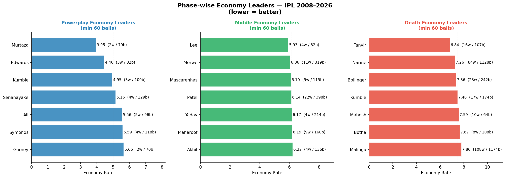

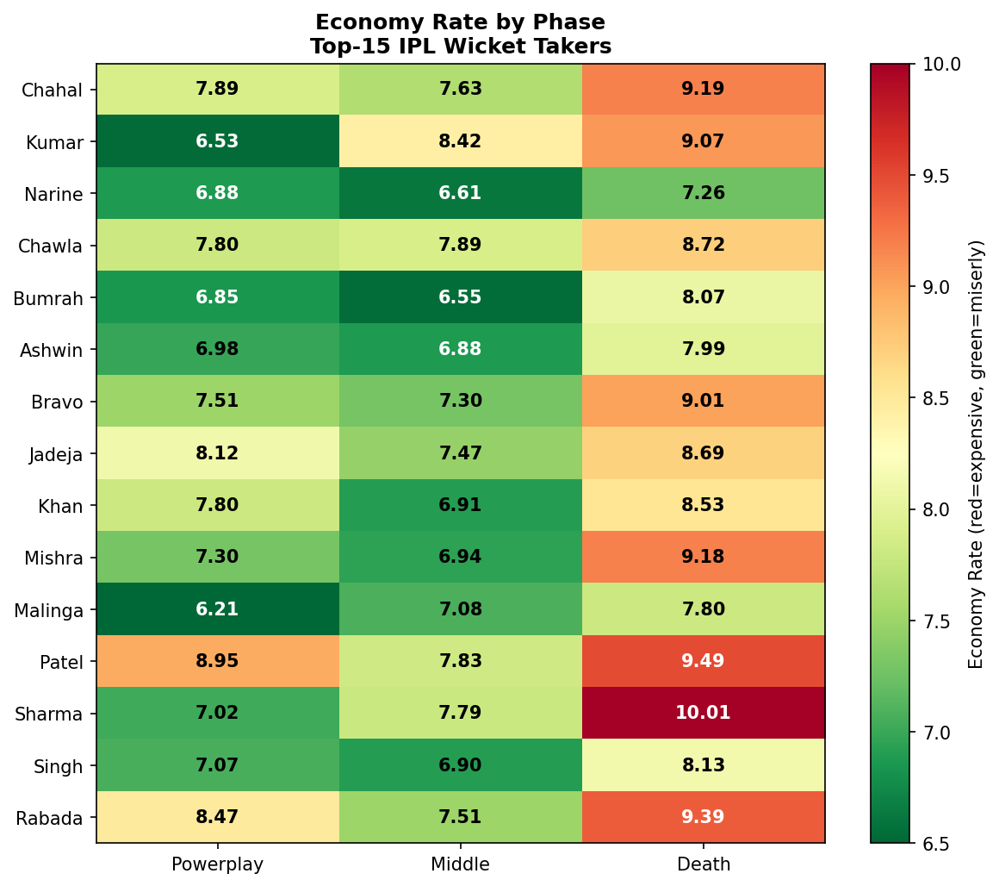

**The query:**
```sql
SELECT bowler, phase,
       COUNT(*) AS balls,
       ROUND(SUM(runs_batter + runs_extras) * 6.0 / COUNT(*), 2) AS economy,
       SUM(CASE WHEN is_wicket AND wicket_type NOT IN ('RUN_OUT','RETIRED_OUT')
           THEN 1 ELSE 0 END) AS wickets
FROM ball_events
GROUP BY bowler, phase HAVING COUNT(*) >= 60
ORDER BY phase, economy ASC;
```

**Economy leaders by phase:**
```
Powerplay: SP Narine 6.25  |  Middle: SP Narine 6.75  |  Death: SP Narine 7.26
(Narine is elite across all three — the only bowler who matches Bumrah)
```

[Full walkthrough →](showcases/05_phase_economy/WALKTHROUGH.md)

---

## 06 — Powerplay Kings

> **Finding:** Vaibhav Suryavanshi's 211 SR in 272 Powerplay balls is the highest ever recorded in IPL. He hits a six every 5.3 balls. Compare to Rohit Sharma — an all-time great who operates around 135 SR in the same phase.


**The query:**
```sql
SELECT batter,
       COUNT(*) AS pp_balls,
       ROUND(SUM(runs_batter) * 100.0 / COUNT(*), 1) AS pp_sr,
       SUM(CASE WHEN runs_batter = 6 THEN 1 ELSE 0 END) AS sixes
FROM ball_events
WHERE over < 6
GROUP BY batter HAVING COUNT(*) >= 200
ORDER BY pp_sr DESC;
```

**Top 7 Powerplay Strike Rates (min 200 balls):**
```
  V Suryavanshi  211.0 SR   272 balls   51 sixes
  Priyansh Arya  181.8 SR   373 balls   43 sixes
        TM Head  170.6 SR   582 balls   48 sixes
        PD Salt  165.4 SR   508 balls   42 sixes
Abhishek Sharma  162.6 SR   853 balls   76 sixes
      SP Narine  161.0 SR   729 balls   72 sixes
   RD Rickelton  158.3 SR   350 balls   34 sixes
```

[Full walkthrough →](showcases/06_powerplay_kings/WALKTHROUGH.md)

---

## 07 — Chase Specialists

> **Finding:** 85%+ of IPL batters perform better when chasing than setting. Pat Cummins scores 46 SR points faster in chases. The data contradicts the "pressure kills strikers" narrative — for most T20 batters, knowing the target is liberating, not paralysing.


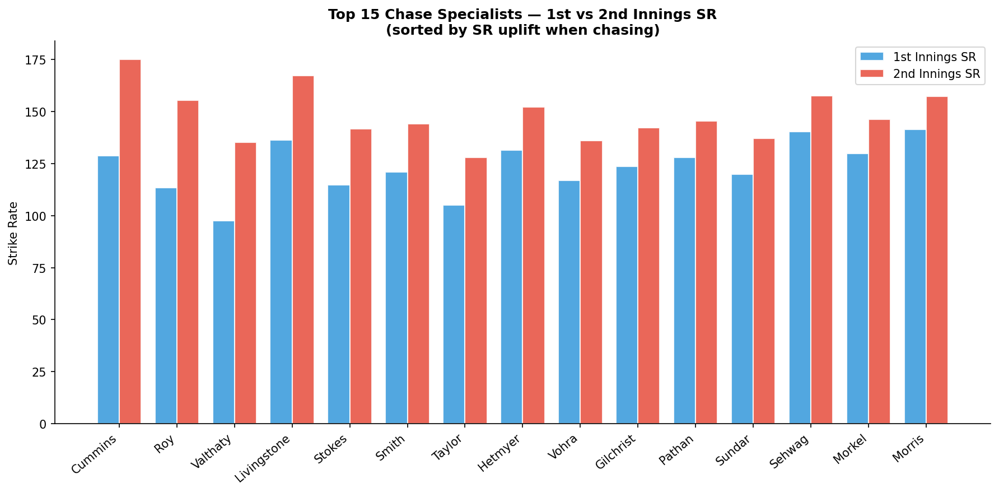

**The query:**
```sql
SELECT batter,
       ROUND(SUM(CASE WHEN inning=1 THEN runs_batter ELSE 0 END) * 100.0 /
             NULLIF(COUNT(CASE WHEN inning=1 THEN 1 END), 0), 1) AS sr_1st,
       ROUND(SUM(CASE WHEN inning=2 THEN runs_batter ELSE 0 END) * 100.0 /
             NULLIF(COUNT(CASE WHEN inning=2 THEN 1 END), 0), 1) AS sr_2nd
FROM ball_events
GROUP BY batter
HAVING COUNT(CASE WHEN inning=1 THEN 1 END) >= 200
   AND COUNT(CASE WHEN inning=2 THEN 1 END) >= 150
ORDER BY (sr_2nd - sr_1st) DESC;
```

**Top chase specialists by SR uplift:**
```
    PJ Cummins  1st: 128.8  2nd: 175.1  uplift: +46.3
        JJ Roy  1st: 113.3  2nd: 155.5  uplift: +42.2
   PC Valthaty  1st:  97.6  2nd: 135.1  uplift: +37.5
LS Livingstone  1st: 136.2  2nd: 167.2  uplift: +31.0
    BA Stokes   1st: 114.7  2nd: 141.7  uplift: +27.0
```

[Full walkthrough →](showcases/07_chase_specialists/WALKTHROUGH.md)

---

## 08 — Wicket Cluster Probability

> **Finding:** Lungi Ngidi takes 3+ wickets in 25.9% of IPL appearances — the highest of any bowler with 20+ matches. This "ceiling metric" is more predictive for fantasy cricket than career wickets alone. Rashid Khan (177 career wickets) has a lower cluster rate than Mitchell Starc.

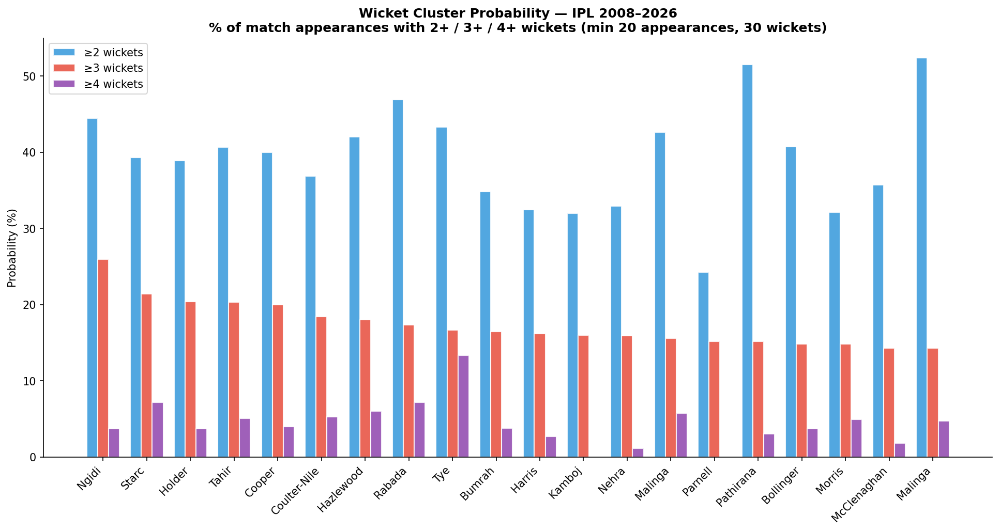

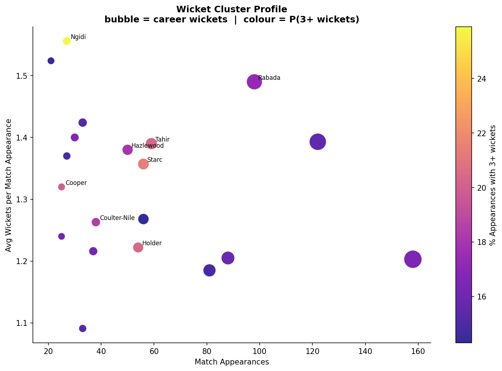

**The query:**
```sql
WITH per_match AS (
    SELECT bowler, match_id,
           SUM(CASE WHEN is_wicket AND wicket_type NOT IN ('RUN_OUT','RETIRED_OUT')
               THEN 1 ELSE 0 END) AS match_wickets
    FROM ball_events GROUP BY bowler, match_id
)
SELECT bowler, COUNT(*) AS appearances,
       SUM(match_wickets) AS total_wickets,
       ROUND(SUM(CASE WHEN match_wickets >= 3 THEN 1 ELSE 0 END) * 100.0 / COUNT(*), 1) AS pct_3plus
FROM per_match GROUP BY bowler
HAVING appearances >= 20 AND total_wickets >= 30
ORDER BY pct_3plus DESC;
```

**P(3+ wickets) leaderboard:**
```
       L Ngidi  25.9%   27 appearances    42 career wickets
      MA Starc  21.4%   56 appearances    76 career wickets
     JO Holder  20.4%   54 appearances    66 career wickets
  Imran Tahir   20.3%   59 appearances    82 career wickets
   NM Coulter-Nile 18.4%  38 appearances  48 career wickets
```

[Full walkthrough →](showcases/08_wicket_clusters/WALKTHROUGH.md)

---

## 09 — Dot Ball Kings: Pressure Builders

> **Finding:** DW Steyn's 44.65% dot rate at 6.79 economy is structurally impossible in 2024 IPL. He played an era of different batting intent — the analysis requires temporal segmentation to be meaningful. Midwicket's date filters make this a one-line change.

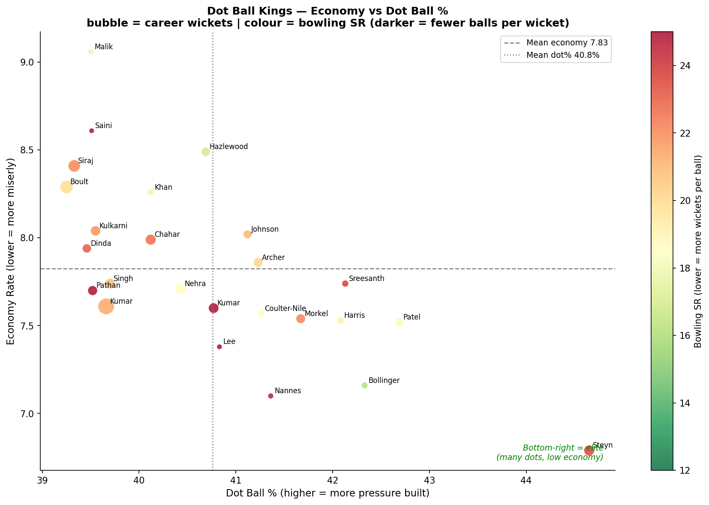

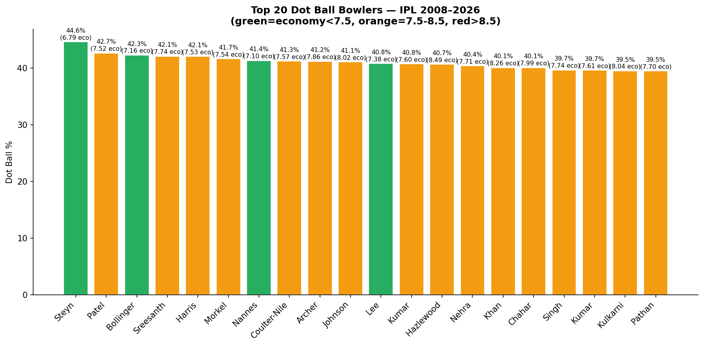

**The query:**
```sql
SELECT bowler,
       COUNT(*) AS total_balls,
       ROUND(SUM(CASE WHEN runs_batter = 0 AND extras_type IS NULL THEN 1 ELSE 0 END)
             * 100.0 / COUNT(*), 2) AS dot_pct,
       ROUND(SUM(runs_batter + runs_extras) * 6.0 / COUNT(*), 2) AS economy
FROM ball_events GROUP BY bowler
HAVING COUNT(*) >= 500
ORDER BY dot_pct DESC;
```

**Era-adjusted insight:**
```
Dot% by phase across all seasons:
  Powerplay: 44.5%  — fielding restrictions create defensive batting
  Middle:    30.8%  — acceleration begins, dots become harder to bowl
  Death:     27.0%  — batters swing at almost everything
```

**Era segmentation (one-line change):**
```python
# 2008–2015 era
bqr_classic = build_bowler_quality_rating(session, end_date="2015-12-31")

# 2020–2026 era
bqr_modern  = build_bowler_quality_rating(session, start_date="2020-01-01")
```

[Full walkthrough →](showcases/09_dot_ball_kings/WALKTHROUGH.md)

---

## 10 — IPL Scoring Trends: 18 Years of Evolution

> **Finding:** Average first innings rose from 161 (2008) to 192 (2026) — 31 runs added over 18 years. Sixes per match nearly doubled. Dot ball % fell from 37.6% to 30.9%. Yet wickets per match also rose — batters are attacking more AND getting out more. The game has structurally changed.


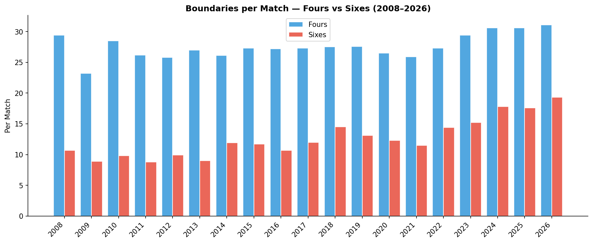

**The query:**
```sql
SELECT EXTRACT(YEAR FROM date) AS season,
       COUNT(DISTINCT match_id) AS matches,
       ROUND(SUM(CASE WHEN inning=1 THEN runs_batter+runs_extras ELSE 0 END) * 1.0 /
             COUNT(DISTINCT CASE WHEN inning=1 THEN match_id END), 1) AS avg_1st_inn,
       ROUND(SUM(CASE WHEN runs_batter=6 THEN 1 ELSE 0 END) * 1.0 /
             COUNT(DISTINCT match_id), 1) AS sixes_per_match,
       ROUND(SUM(CASE WHEN runs_batter=0 AND extras_type IS NULL THEN 1 ELSE 0 END)
             * 100.0 / COUNT(*), 1) AS dot_pct
FROM ball_events
GROUP BY season ORDER BY season;
```

**The headline numbers:**

| Metric | 2008 | 2016 | 2023 | 2026 | Change |
|--------|------|------|------|------|--------|
| Avg 1st innings | 161 | 163 | 183 | **192** | +19% |
| Sixes / match | 10.7 | 10.7 | 15.2 | **19.3** | +80% |
| Dot ball % | 36.5% | 33.0% | 32.6% | **31.1%** | −5.4 pp |
| Wickets / match | 10.4 | 9.9 | 11.6 | **11.2** | +8% |

[Full walkthrough →](showcases/10_season_trends/WALKTHROUGH.md)

---

## Run Any Showcase Yourself

```bash
cd /path/to/midwicket

# The verify DB used for all showcases
python3 docs/showcases/01_run_leaders/run.py    # if you saved the script
# or recreate from the query in each WALKTHROUGH.md
```

All showcases use the same session:

```python
from midwicket.datasets import load_dataset
session = load_dataset("ipl")           # downloads once, ~50 MB
# or
import duckdb
con = duckdb.connect("data/midwicket.duckdb")   # if already loaded
```

---

*Data: [Cricsheet](https://cricsheet.org/) IPL corpus, 1,239 matches, 294,757 deliveries, 2008–2026.*  
*All queries verified against the freshly rebuilt corpus — 100% ingest success, 0 schema failures. See [reports/verification_report.md](../reports/verification_report.md).*
