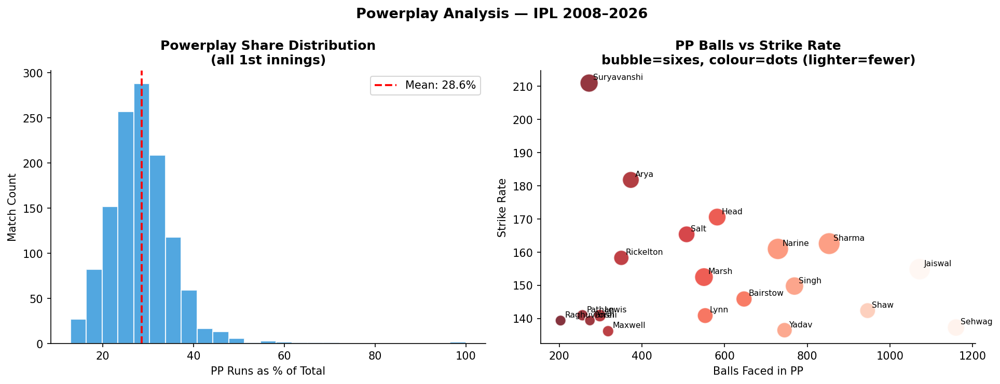

# Showcase 06 — Powerplay Kings

**One sentence:** Vaibhav Suryavanshi's 211 SR in the powerplay is the highest ever recorded in IPL — the 2025 rookie re-defined what's possible.

---

## The Question

Who hits hardest in the opening 6 overs? How has the Powerplay evolved from a conservative opening phase to an attack-first phase?

## The Insight


The chart overlays **strike rate bars** with a **dot ball % line** — the two fundamental tensions of powerplay batting. The ideal batter (top-left of the dot line, tall bar) attacks aggressively while keeping dots low.

The most striking data point: **V Suryavanshi at 211 SR in 272 PP balls** — more than double the scoring rate of a dot ball. He hits 51 sixes in powerplay alone. Compare this to Rohit Sharma (consistent but around 135 SR) — the generational shift in intent is stark.

Other revelations:
- **Priyansh Arya** (181.8 SR): the IPL 2025 sensation who trained against Bumrah
- **Abhishek Sharma** (162.6 SR, 853 balls): the largest PP sample in the top tier, consistently destructive



The distribution plot shows the **average PP share of total 1st innings runs**: around 34% — but top teams weaponize it to push 40%+.

## Key Numbers

| Batter | PP SR | PP Balls | PP Sixes |
|--------|-------|----------|----------|
| V Suryavanshi | 211.0 | 272 | 51 |
| Priyansh Arya | 181.8 | 373 | 43 |
| TM Head | 170.6 | 582 | 48 |
| PD Salt | 165.4 | 508 | 42 |
| Abhishek Sharma | 162.6 | 853 | 76 |

## The Query

```sql
SELECT batter,
       COUNT(*) AS pp_balls,
       SUM(runs_batter) AS pp_runs,
       ROUND(SUM(runs_batter) * 100.0 / COUNT(*), 1) AS pp_sr,
       SUM(CASE WHEN runs_batter = 6 THEN 1 ELSE 0 END) AS sixes
FROM ball_events
WHERE over < 6
GROUP BY batter
HAVING COUNT(*) >= 200
ORDER BY pp_sr DESC;
```

## Files

| File | Description |
|------|-------------|
| `06_pp_kings.png` | SR bars + dot% line for top 20 PP batters |
| `06_pp_detail.png` | PP share histogram + scatter |
| `output.txt` | Full leaderboard |
