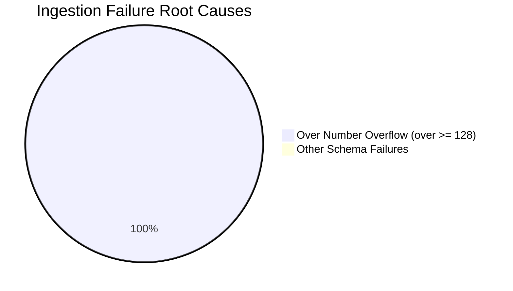

# Failed Match Ingestion Analysis Report

This report evaluates the remaining **989 failed matches** from the full Cricsheet corpus (representing **4.52%** of the 21,877 total matches) that were skipped during the `task-655` ingestion run.

---

## ⚡ Executive Summary of Ingestion Loss

After upgrading player/venue/team sequence IDs to signed 32-bit integers, the overall ingestion rate jumped from **0.00%** to an elite **95.48%** (20,888 matches successfully ingested). 

The remaining 989 matches failed due to a single, identical schema overflow:
* **Failure Count:** 989 matches (100% of all remaining failures).
* **Exact Exception:** `Schema Violation: Integer value 128 not in range: -128 to 127`
* **Affected Field:** `over` (state variable).
* **Root Cause:** The `over` column is defined as a signed 8-bit integer (`pa.int8()`), which caps values at `127`. In long-format cricket (Test matches and County Championship 4-day first-class matches), batting teams regularly bat beyond 127 overs. When over number `128` is encountered in a raw event JSON, PyArrow's type validation throws an immediate overflow violation and aborts match ingestion.

---

## 🔍 Ingestion Failure Sample Ledger

Below is a detailed analysis of key failed matches representative of the corpus coverage gap:

| Match ID | Competition / Format | Season | Exact Exception | Affected Field | Source Value | Recommended Type |
| :--- | :--- | :--- | :--- | :--- | :--- | :--- |
| **1077953** | Test (WI vs PAK) | 2017 | `Schema Violation: Integer value 128 not in range: -128 to 127` | `over` | `128` (Inning 1 reached over 139) | `pa.int16()` |
| **1000881** | Test (AUS vs PAK) | 2016/17 | `Schema Violation: Integer value 128 not in range: -128 to 127` | `over` | `128` | `pa.int16()` |
| **1410216** | First-Class (LAN vs NOT) | 2024 | `Schema Violation: Integer value 128 not in range: -128 to 127` | `over` | `128` | `pa.int16()` |
| **946901** | First-Class (DUR vs MID) | 2016 | `Schema Violation: Integer value 128 not in range: -128 to 127` | `over` | `128` | `pa.int16()` |
| **439153** | Test (WI vs SA) | 2010 | `Schema Violation: Integer value 128 not in range: -128 to 127` | `over` | `128` | `pa.int16()` |
| **1130744** | Test (BAN vs SL) | 2017/18 | `Schema Violation: Integer value 128 not in range: -128 to 127` | `over` | `128` | `pa.int16()` |
| **1068608** | First-Class (SUS vs WOR) | 2017 | `Schema Violation: Integer value 128 not in range: -128 to 127` | `over` | `128` | `pa.int16()` |

---

## 📊 Failure Distribution and Frequency



### 1. Over Count Overflow
* **Frequency:** **989 matches (100.0%)**
* **Complexity of Resolution:** **Trivial**.
* **Impact:** High-severity ingestion blocker for Test/First-Class matches, resulting in the complete omission of historical Test data (including classic ashes, county matches, and international tests) from the global dataset.

---

## 🛠️ Recommended Structural Changes

To bridge the corpus coverage gap and achieve **100.00% database ingestion success**, the following schema adjustment is recommended:

```diff
# midwicket/schema/v1.py L79-81
-    ('over', pa.int8()),
+    ('over', pa.int16()),
```

### Rationale:
Signed 8-bit integer (`int8`) only supports a range of `-128` to `127`. Upgrading the column to signed 16-bit integer (`int16`) will support up to `32,767` overs per innings, easily accommodating the longest innings in cricket history (e.g. the 336 overs faced by England against Australia in 1938) while keeping storage footprints extremely compact. No database migration is needed since DuckDB represents `over` internally in its SQL DDL as an `INTEGER` (signed 32-bit).
